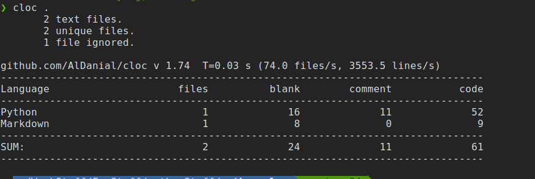
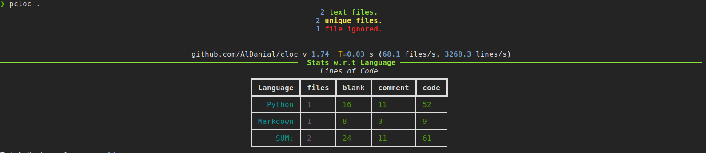

# PCLOC

A python wrapper for [cloc](https://github.com/AlDanial/cloc) to get pretty outputs.

# Motivation

Ever used `cloc` to count SLOC in a project? 
Ever wondered to get the same raw output produced by the perl script, but in prettier way?
... comes in PCLOC. 

# How it Works

`PCLOC` uses [RICH](https://github.com/willmcgugan/rich), a python library, to prettify the output produced by `cloc`

# Screenshots

  Regular `cloc` output :

  `pcloc` output :

